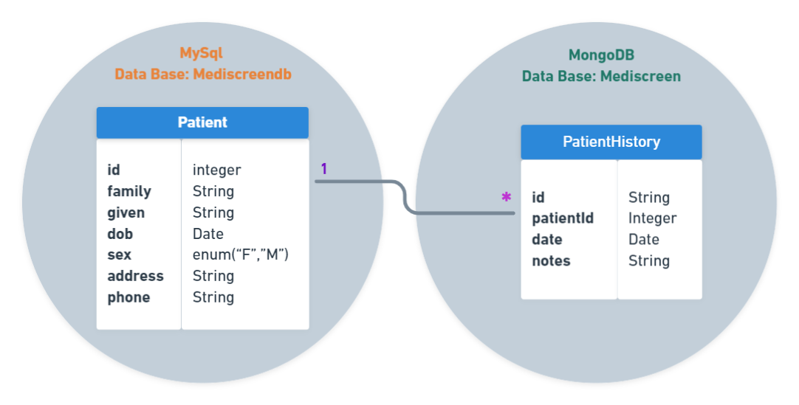
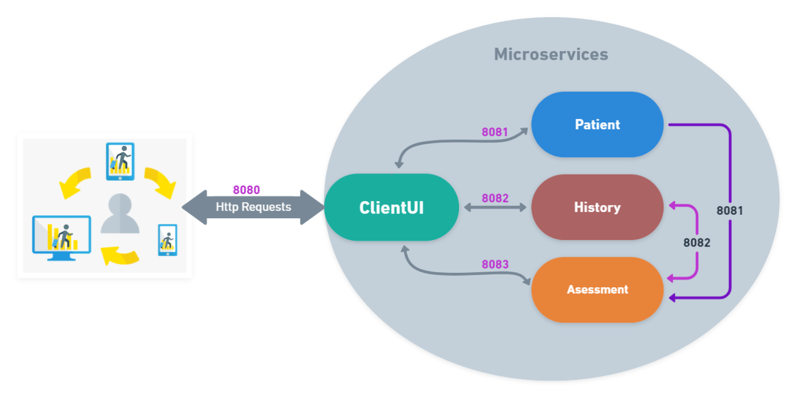

MediscreenApp 
========================

### General common structure


Description
------------
MediscreenApp is an application dedicated to the management of patient data
as well as their therapeutic follow-ups of balance sheets generated by doctors
allowing to establish the level of criticality of diabetes.

Mediscreen is a project made up of 4 distinct entities, 3 management microservices 
and a clientUI dedicated to the party display.
------------
## Prerequisites
### Technologies
- Java 11 JDK
- Maven 2.7.7
- SpringBoot
- Sprint Data JPA
- MySql 
- MongoDB
- Docker  

### Installing
Install Java: - https://www.oracle.com/fr/java/technologies/javase-downloads.html

Install Maven - https://maven.apache.org/install.html

install MySql: - https://dev.mysql.com/downloads/mysql

Intall MongoDB: - https://docs.mongodb.com/manual/administration/install-community/

Install Docker: - https://www.docker.com/products/docker-desktop

Then you can test the endpoints with Postman for example.
* https://www.postman.com/downloads/
------------
## Microservices details

#### Port 8080 - ClientUI: 

* It is the micro service managing the user interface by communicating thanks to Feign (HTTP client which greatly 
facilitates the call of APIs) with the 3 other micro-devices.
To facilitate front-end development,  and
 are used.
* 
#### Port 8081 - Patient:
* It allows to process CRUD requests in order to manage the information of a patient and also exposes other endpoints to 
search for a patient by his last name or his id.
  To do this, the API communicates with a  database.
* 
#### Port 8082 - History:
* This pictorial term in fact represents the entire history of all the notes that a doctor takes through the various 
consultations of a patient. History exposes the REST endpoints allowing to manage all requests to create, update, delete 
and display a patient's note history and also allows you to search for histories by keyword
To do this, this microservice communicates with a  database.

#### Port 8083 - Assessment:
* This microservice defines the criticality level of a patient's diabetes based on the data retrieved by communicating 
through Feign with Patient and History. For this it exposes 2 REST endpoints, the first by a search on the last name
therefore returning the result for each patient found or for a single pateint found by its id. 

------------
## Run the application

Once the project is in your preferred IDE, before launching it, you will obviously have to have installed
the prerequisites listed above.
To run the application, you will first have to go to each root directory of the 4 micro-services to launch 2
commands with Git Bash for example:
* Build each micro-services, with Maven:
  ``` 
  * $ maven build
  ``` 
* Then you will need to build each microservices docker image using the command
  ``` 
  * $ docker build -t NAME_OF_YOUR_IMAGE . 
  * ex: $ docker build patient-microservice .
    (Be careful not to forget the full point at the end)
  ``` 
* Once all the docker images are built, all you have to do is build the docker-compose, which will be launched
  automatically, using the command
   ``` 
  * $ docker-compose up
  ``` 
------------
## Modelization
###  Class Diagram

###  TourGuide Architectural Overview


------------
## Author
###Yvonnet L.  - OpenClassRooms student -
